# News Mood App

This project demonstrates how to use AWS services to build a serverless application that retrieves news, determines its sentiment (positive, neutral, or negative), stores it in DynamoDB, and allows users to request news based on sentiment via an API Gateway.

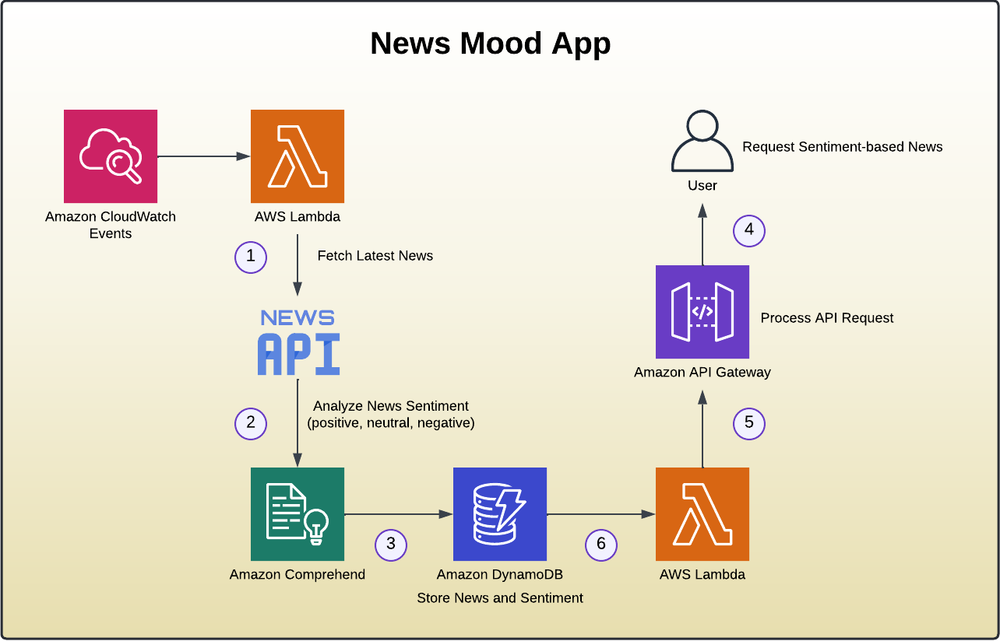

## Project Overview

**News Mood App** is designed to fetch top news stories, analyze their sentiment using Amazon Comprehend, and store the results in DynamoDB. The user can then query the news based on sentiment through an API.

### Services Used

- **AWS Lambda**: Executes backend logic for news retrieval, sentiment analysis, and data management.
- **Amazon DynamoDB**: Stores news articles and their associated sentiment.
- **Amazon API Gateway**: Exposes the API endpoints for users to request news based on sentiment.
- **Amazon Comprehend**: Determines the sentiment of news articles.
- **Amazon CloudWatch**: Logs function invocations for debugging and performance monitoring.

### Prerequisite: Get an API Key from newsapi.org

Before starting, you need to **sign up** for an API key from [newsapi.org](https://newsapi.org/). This key will allow your Lambda function to fetch top news stories from the News API.

1. Go to [newsapi.org](https://newsapi.org/).
2. Sign up and obtain your API key.
3. You will use this API key in your Lambda function code to fetch news articles.

## Setup

### Step 1: AWS Role Creation

1. **Open the IAM Console** and create a new role with **Lambda** as the trusted entity.
2. Attach the **`AWSLambdaBasicExecutionRole`** to grant permissions for CloudWatch logging.
3. After creating the role, attach the custom inline policy that grants specific permissions for **DynamoDB** and **Comprehend**. This policy allows your Lambda function to interact with DynamoDB and perform sentiment analysis using Comprehend.

```json
{
	"Version": "2012-10-17",
	"Statement": [
		{
			"Effect": "Allow",
			"Action": [
				"dynamodb:PutItem",
				"dynamodb:GetItem",
				"dynamodb:Scan",
                "dynamodb:Query",
				"dynamodb:DeleteItem",
				"comprehend:DetectSentiment"
			],
			"Resource": "*"
		}
	]
}
```

### Step 2: Create DynamoDB Table

In this step, we will create a DynamoDB table to store news articles and their associated sentiment analysis results.

1. Navigate to the **DynamoDB** console.
2. Click on **Create Table**.
- **Table Name**: `news`
- **Primary Key**: `sentiment` (String)
- **Sort Key**: `timestamp` (String)
3. Click **Create**.

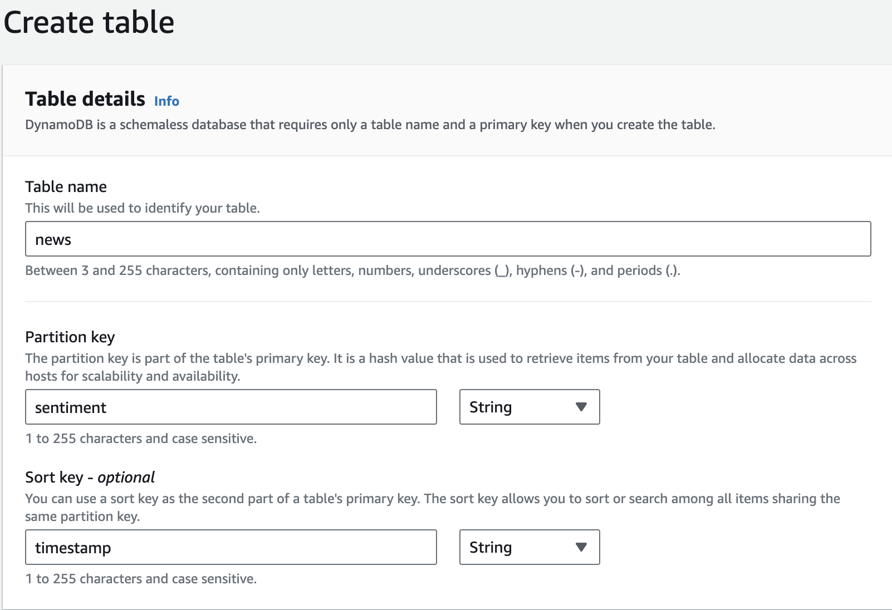

The primary key is `sentiment`, which will store values like `POSITIVE`, `NEGATIVE`, or `NEUTRAL`. The sort key is `timestamp`, which stores the time the news article was analyzed and stored.

#### Verify Table Creation

1. Once the table is created, go to the **Explore table items**.
2. You should see an empty table with no items yet. This will be populated after your Lambda function inserts news articles and their sentiment.

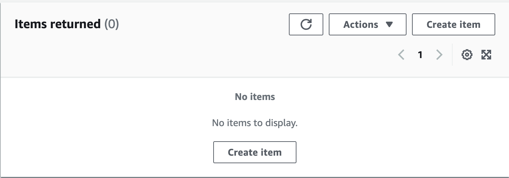

### Step 3: AWS Lambda for Inserting News and Sentiment

Create a new **Lambda function** to insert news articles and analyze their sentiment.

- **Function Name**: `insertsentimentdynamo`
- **Runtime**: Python 3.12
- **Role**: Attach the role you created earlier with access to DynamoDB and Comprehend.

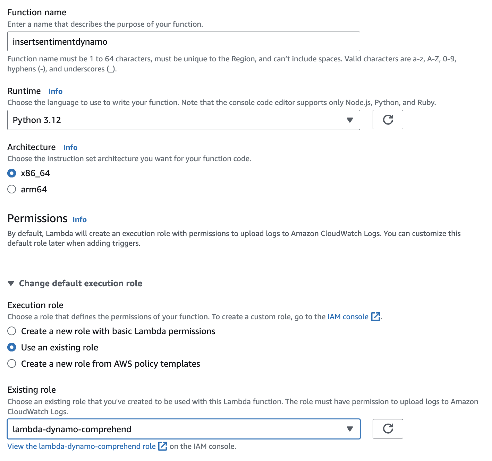

#### Add Python Code:

Add the following code to the Lambda function. Replace the placeholder values like the API Key with the one you obtained from newsapi.org in the **`findNews`** function. 

``` python
import requests
import json
import datetime
import boto3


#this lambda grabs today's headlines, does sentiment analysis using AWS Comprehend
#and saves the news along with sentiment into a dynamodb table
def lambda_handler(event, context):
    # TODO implement
    print("button pressed")
    print(event)
    print("just changing a print")
    if event['action']=='insert news':
        findNews()
    else:
        deleteNews()
    
    return 'End of News Sentiment IOT function'


def deleteNews():
    dynamodb = boto3.resource('dynamodb')
    table = dynamodb.Table('news')
    #Scanning the table to get all rows in one shot
    response =table.scan()
    if 'Items' in response:
        items=response['Items']
        for row in items:
            sentiment=row['sentiment']
            timestamp=row['timestamp']
            delresponse = table.delete_item(
                Key={
                'sentiment': sentiment,
                'timestamp':timestamp
                    }
                    ) 

def findNews():
    #News credit to newsapi.org
    #Fetch headlines using the API
    #IMPORTANT: Register in newsapi.org to get your own API key, it's super easy!
    response = requests.get("https://newsapi.org/v2/top-headlines?country=us&category=business&apiKey=ADD YOUR API KEY")
    d=response.json()
    if (d['status']) == 'ok':
        for article in d['articles']:
            print(article['title'])
            newsTitle=article['title']
            timestamp=article['publishedAt']
            sentiment=json.loads(getSentiment(newsTitle))
            print(sentiment['Sentiment'])
            insertDynamo(sentiment['Sentiment'],newsTitle,timestamp)

#getSentiment function calls AWS Comprehend to get the sentiment
def getSentiment(newsTitle):
    comprehend = boto3.client(service_name='comprehend')
    return(json.dumps(comprehend.detect_sentiment(Text=newsTitle, LanguageCode='en'), sort_keys=True))

#inserts headline along with sentiment into Dynamo    
def insertDynamo(sentiment,newsTitle,timestamp):
    print("inside insert dynamo function")
    dynamodb = boto3.resource('dynamodb')
    table = dynamodb.Table('news')
    response = table.put_item(
       Item={
        'sentiment': sentiment,
        'title': newsTitle,
        'timestamp' : timestamp
       }
       )
```

### Bonus: How to Install Python Dependencies on Lambda

To include external Python libraries (like `requests`) in your AWS Lambda function, follow these steps:

1. **Create a folder** on your local computer where you will place your Lambda code.
2. **Add Lambda files** (your Python code) into this folder.
3. **Open your terminal** and `cd` into the folder.
4. **Install the `requests` library** by running this command:
   ```bash
   pip install requests -t .
   ```
You should see several new folders for the installed dependencies inside your directory.

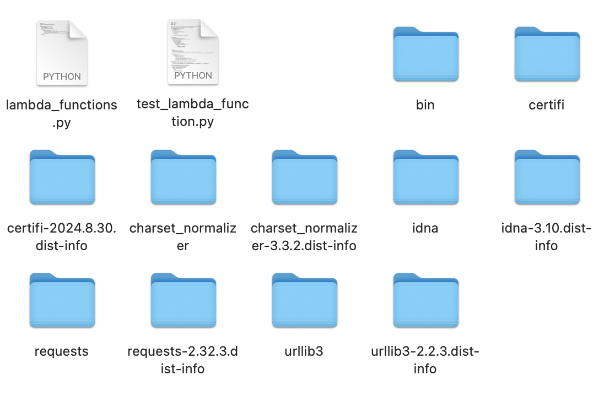

5. Highlight **all the folders and files inside the main folder** (not the folder itself) and compress them into a `.zip` file.
   
   **Tip**: Highlighting all the contents inside the folder (instead of zipping the main folder) prevents error messages when uploading to Lambda.

6. In the **AWS Lambda Console**, go to your Lambda function.
7. Click on **Upload from** > **.zip file**, and choose the zip file you just created. You should now see your files.

### Step 4: Deploy and Test

#### Creating an INSERT Operation

1. Once the code is added, click **Deploy**.
2. Click **Test** to create a new test event.
    - Name the event: **InsertTest**.
    - Choose the template: **Hello World**.
    - Paste the following JSON into the event body:
    
    ```json
    {
        "action": "insert news"
    }
    ```

3. Click **Save**.
4. Click **Test** to execute the function. You should receive a confirmation message that the Executing function: succeeded. 
5. Go to **DynamoDB Console**, open the `news` table, and click on **Explore table items** to view the inserted data.

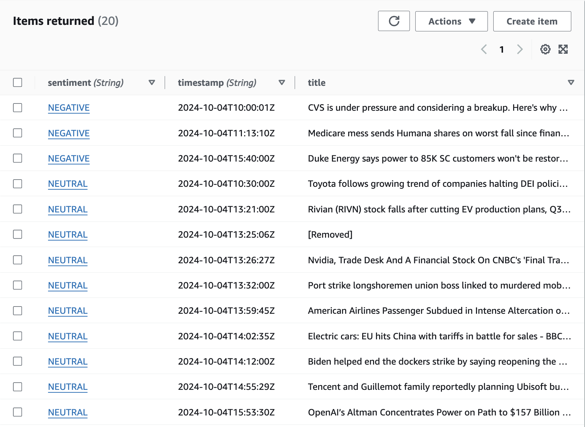

> **Note**: This only fetches and inserts the title of the news articles into the table. If you want to include more information, modify the Lambda function to pass more fields such as the description, URL, or author.

#### DELETE Operation

1. **Look at the code**:
    - In the Lambda function code, notice the condition:
    
    ```python
    if event['action'] == 'insert news':
    ```
    - If the action is **not** `insert news`, the function will delete the existing news items from DynamoDB.

2. Go back to the Lambda function's **Test** configuration.
3. Use the same **InsertTest** template but change the event name to **DeleteTest**.
4. Update the JSON to trigger the delete action:
    
    ```json
    {
        "action": "delete news"
    }
    ```

5. Click **Test** again to execute the delete function.
6. Go back to the **DynamoDB Console** and check the **Items** in the `news` table. The data should now be deleted.

By following these steps, you can verify that both the **insert** and **delete** operations are working correctly with your Lambda function and DynamoDB.

### Step 5: Setup CloudWatch Events

To automate the execution of your Lambda function, we will set up a CloudWatch rule that triggers the Lambda function on a schedule.

#### Create a Scheduled Rule in CloudWatch

1. Open the **CloudWatch Console**.
2. In the left-hand menu, select **Rules** under **Events**. Click **Create Rule**.
3. Under **Event Source**, choose **Schedule**.
5. Choose **Event Source**: Fixed rate of 3 minutes. Set the schedule to trigger every 3 minutes for testing purposes:
6. Under **Targets**, choose **Lambda function**. Select the Lambda function you created.
7. Configure the input for the Lambda function:
     - Choose **Constant JSON** as input.
     - Paste the following JSON:
     
     ```json
     {
        "action": "insert news"
     }
     ```
8. Provide a name for the rule: `NewsMoodLambdaSchedule`.
9. Click **Create Rule** to finalize.

#### Monitor the Rule Execution

1. After creating the rule, click on it to view the **Monitoring** section.
2. You will see **Metrics** for the rule showing how often the Lambda function is triggered.
3. Wait a few minutes and check if the rule has invoked the Lambda function by viewing the **Invocations**.

#### View Logs in CloudWatch

1. Go to the **Lambda Console**.
2. Navigate to the **Monitoring** tab of your Lambda function.
3. Click on **View logs in CloudWatch**. This will open the CloudWatch logs where you can view the detailed logs of each Lambda invocation.
4. Look for the **Start RequestId** — this indicates when the rule triggered the Lambda function.

#### Verify Data in DynamoDB

1. After a few minutes, go back to **DynamoDB Console** and check the **Items** in your `news` table. You should see multiple rows with new data inserted every 3 minutes.

#### Cleanup: Delete the CloudWatch Rule

To avoid unnecessary charges, delete the CloudWatch rule once testing is complete:

1. Go back to the **CloudWatch Console**.
2. Under **Rules**, find the rule `NewsMoodLambdaSchedule`.
3. Click **Actions** and select **Delete**.

By following these steps, you will have a CloudWatch rule triggering your Lambda function to insert news data into DynamoDB every 3 minutes. Don't forget to remove the rule to prevent ongoing charges.

### Step 6: Update Lambda Code for Querying Sentiment-Based News

In this step, we will update the code to a Lambda function that will accept sentiment as an input, query the DynamoDB table, and return news based on the sentiment. The function will limit the results to the 10 most recent news articles.

#### Add New Code to Lambda

1. **Open the AWS Lambda Console** and locate the Lambda function we created.
2. Replace the existing code with the following Python code:

```python
import boto3
from boto3.dynamodb.conditions import Key

# Initialize DynamoDB resource
dynamodb = boto3.resource('dynamodb')

def lambda_handler(event, context):
    # Reference the 'news' table in DynamoDB
    table = dynamodb.Table('news')
    inputSentiment = event['sentiment']
    
    try:
        # Query the DynamoDB table using the sentiment as the key
        response = table.query(
            KeyConditionExpression=Key('sentiment').eq(inputSentiment),
            Limit=10,  # Limits returned news to 10
            ScanIndexForward=False  # Fetches the most recent news first (descending order of timestamp)
        )
        return response
    except:
        raise
```
#### Explanation of the Code:
- DynamoDB Table: The function queries the DynamoDB table news to find articles with the specified sentiment.
- Sentiment Input: The function accepts a sentiment (e.g., POSITIVE, NEGATIVE, NEUTRAL) as input from the event.
- Limit: The function limits the results to 10 news articles.
- ScanIndexForward: Set to False to return the most recent news articles first.
- KeyConditionExpression: This filters results by the primary key (sentiment), returning only articles that match the input sentiment.

#### Configure a Test Event:
To test the Lambda function, configure a test event in the Lambda console:
```json
{
  "sentiment": "NEUTRAL"
}
```
- After setting up the test event, run it and check the Execution Log/Results to see if the function successfully queries the DynamoDB table and returns the expected news articles.

### Step 7: Create and Secure API Gateway to Expose Lambda

Now that the Lambda function is ready, we will create an **API Gateway** to expose this Lambda function as a backend service and secure it using API keys.

1. **Go to the API Gateway Console**.
2. **Create a new Rest API**:
   - **API Name**: `ReadNews`
3. **Create a Resource** under your API:
   - **Resource Name**: `NewsReader`
4. **Create a POST Method** for this resource and integrate it with your Lambda function.

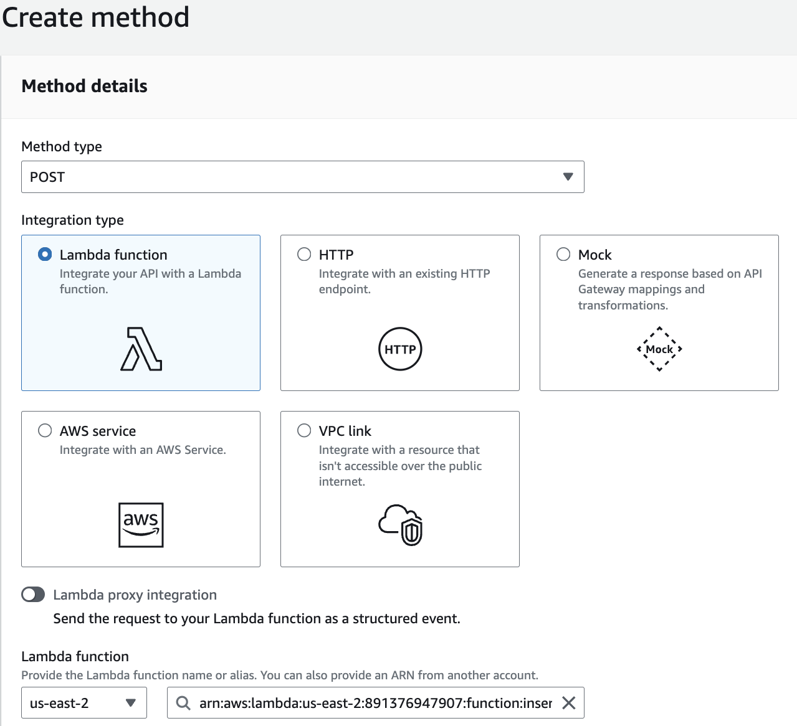

5. **Deploy the API**:
   - Click on **Actions** > **Deploy API**.
   - Create a new stage:
     - **Stage Name**: `Dev`
     - **Description**: Initial deployment  

### Secure API with API Keys

1. **Create Usage Plan**:
   - In the API Gateway you just created click on **Usage Plans**.
   - Create a new usage plan, and associate it with the API stage in the next steps.

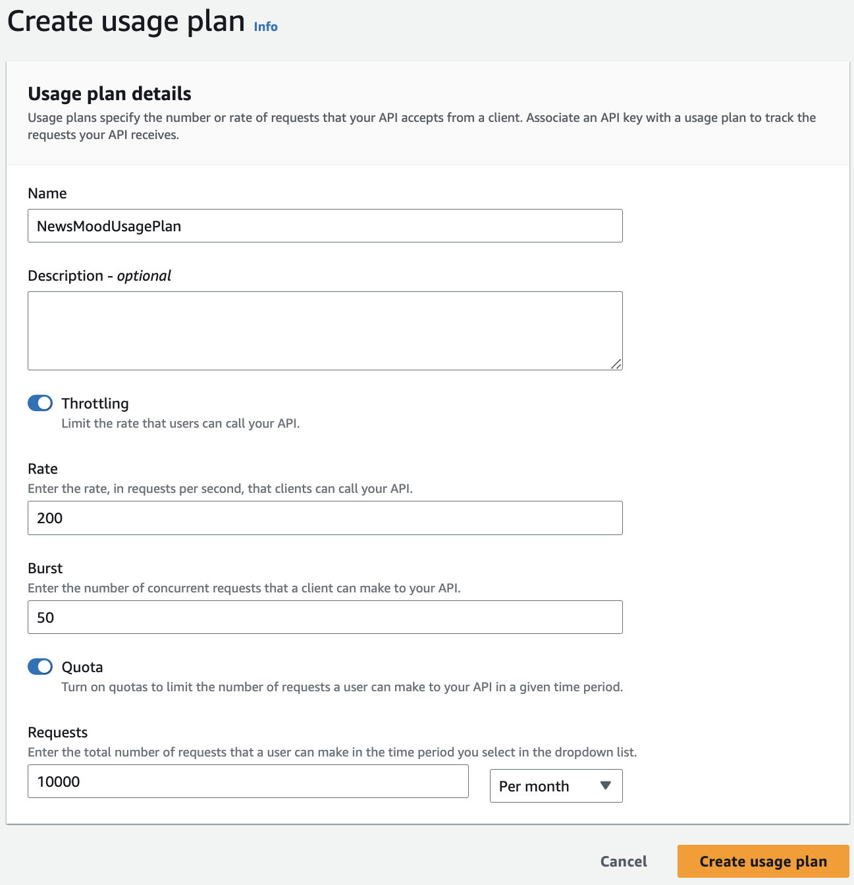

   - Click **Add API Stage**: Add the `ReadNews` API - **Dev** (Stage).
   - In the **Usage Plan**, under **Associated API Keys**, click **Add API Key** and add your API key from newsapi.org. 

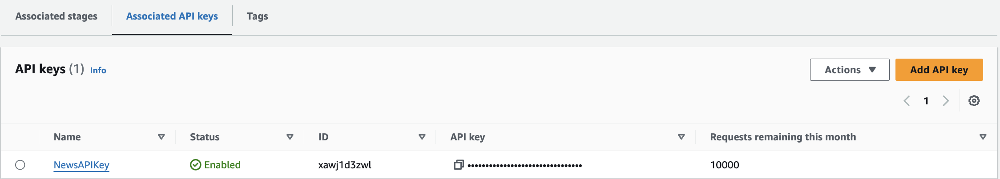

3. **Enforce API Key Requirement**:
   - Go back to the **API Gateway Console**.
   - Under your API, navigate to **Resources**.
   - Select the **POST Method** under **NewsReader**.
   - In **Method Request**, click **Edit**, set **API Key Required** to **true** by checking the box.

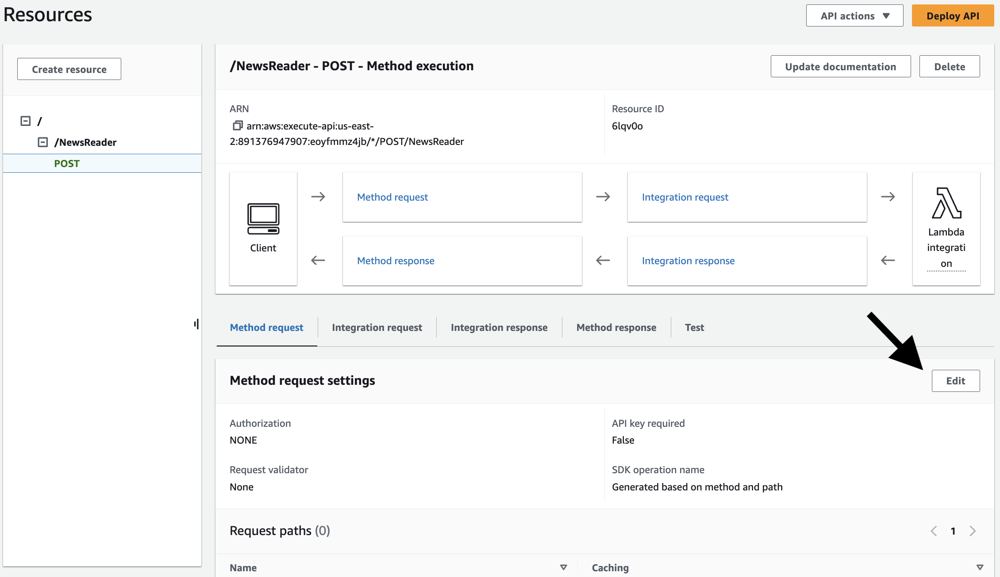

   - Click **Actions** > **Deploy API** to the **Dev** stage and add a description like: `Added API Key requirement`.
   - After deployment, expand the Dev stage, click on the **POST method** to get the **Invoke URL**.
   - Copy the **Invoke URL** for testing or future use.


### Test API with Postman

1. Open **Postman** and send a POST request to the API URL.
2. You should receive a **403 Forbidden** message since the API requires an API key.
3. Add the API Key in **Postman**:
   - Under the **Headers** section, add the following:
     - **Key**: `x-api-key`
     - **Value**: Your copied API key.
4. Send the request again, and you should now receive a valid response.

### New Deployment (Prod Stage)

1. Go back to the **API Gateway Console**.
2. **Actions** > **Deploy API**:
   - Deploy to a new stage called **Prod**.
   - Add a description like: `Final Production Deployment`.
3. Copy the new **Invoke URL** for the Prod stage.

4. **Go back to the Usage Plan**:
   - Add the **Prod** stage under **Associated API Stages**.
   - Usage Plan: `UsagePlanDemo`.
   - Add the **ReadNews** API - **Prod** stage.

### Testing in Postman (Prod Stage)

1. Add the new **Prod URL** in Postman (with the API key already added in headers).
2. Send the request, and it should work.
3. Try changing the body input to test different sentiments (e.g., `POSITIVE`, `NEUTRAL`, `NEGATIVE`):

```json
{
   "sentiment": "POSITIVE"
}
```
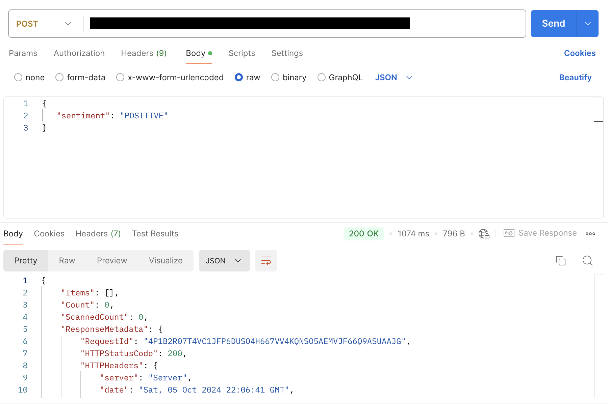

All Done! Thank you for following along. 

### Clean Up

To avoid ongoing costs for resources you might not use in the future, it's a good idea to clean up the AWS resources that were created. Here’s how to do that:

1. **Delete the DynamoDB Table**:
   - Go to the **DynamoDB Console**.
   - Find the `news` table, select it, and click **Delete**.

2. **Delete the Lambda Functions**:
   - Go to the **Lambda Console**.
   - Select each Lambda function you created (`insertsentimentdynamo`, `fetchnewsbasedonsentiment`), and delete them.

3. **Delete the API Gateway**:
   - Go to the **API Gateway Console**.
   - Select the `ReadNews` API and click **Delete API** under **Actions**.

4. **Remove the CloudWatch Log Groups**:
   - Go to the **CloudWatch Console**.
   - In the left-hand menu, click **Log groups**.
   - Find the log groups associated with your Lambda functions and delete them.

5. **Remove any IAM Roles and Policies**:
   - Go to the **IAM Console**.
   - Navigate to **Roles**, find the roles you created for this project, and delete them.
   - Also, delete any custom inline policies you may have attached.

